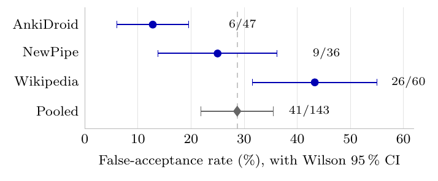
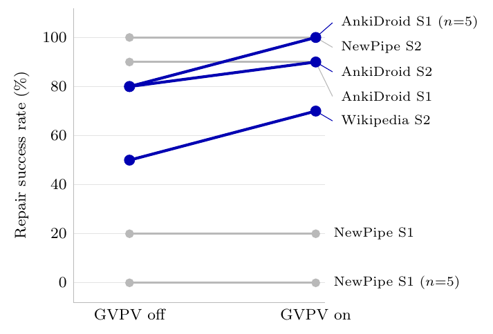
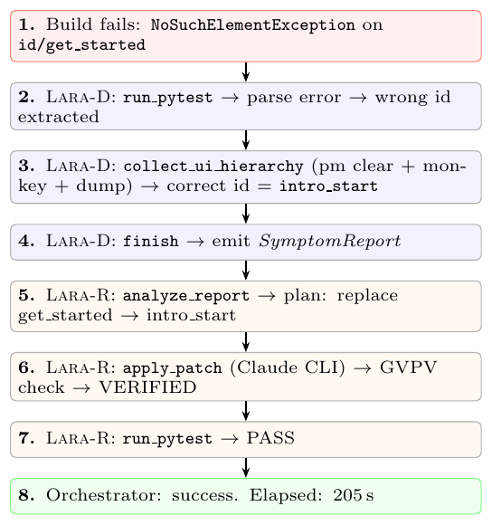

# Per-Patch Scoring of Validation Gates for UI Test Repair — Replication Data

Derived data and figures for:

> Dong Kwan Kim. *Episode-Level Evaluation Hides False Acceptances: Per-Patch
> Scoring of Validation Gates for UI Test Repair.*
> **Software: Practice and Experience**, 2026.

This repository holds the **derived data and figures** behind every number
reported in the article, a data dictionary, and a mapping from each reported
result to the file it comes from. The agent, gate, and analysis **source code
is not included here**; it is available from the corresponding author on
request (see [Source code](#source-code)).

---

## What the study measured

A pre-test validation gate (Grounding-Verified Patch Validation, GVPV) decides
whether an LLM-generated patch may proceed to the test suite. The article's
central point is one of **unit of analysis**: scored per repair *episode*, any
gate records zero false acceptances, because a successful episode ends on a
patch the test accepted by definition. Scored per candidate *patch*, the same
runs expose 41 false acceptances.

Every quantity here is therefore keyed to **patch decisions**, not episodes.

| | |
|---|---|
| Gate-live runs | 180 |
| Patch decisions adjudicated | 188 |
| Admitted | 143 |
| Rejected | 45 (23.9 %) |
| Admitted but failed the next pytest (false acceptance) | 41 (28.7 %) |

---

## Repository layout

```
data/
  perpatch_summary.json      full derived per-patch analysis (JSON, authoritative)
  per_substudy.csv           decisions and FA counts per sub-study
  fa_by_subject.csv          FA rate per application
  fa_taxonomy.csv            FA classified by the oracle value enforced
  fa_events.csv              one row per false acceptance
  rejections_by_check.csv    rejections attributed to each gate check
  replication_n5.csv         contextual n=5 replication, both platforms
  holdouts.csv               two holdout studies, full pipeline vs patch-only
  healenium.csv              production locator-healing baseline
  run_summaries/             per-run JSON summaries (10 files)
logs/                        raw run logs for the 180 gate-live runs (32 files)
figures/
  fig1_running_example.{pdf,png}
  fig2_fa_stratified.{pdf,png,csv}
  fig3_gvpv_paired.{pdf,png,csv}
DATA_DICTIONARY.md           every column of every file
RESULTS_MAP.md               each reported table/figure/finding -> its file
```

---

## Figures

### Figure 2 — False-acceptance rate by application



The pooled 28.7 % is not a property of the gate alone. Across the three
subjects the rate spans 12.8 % to 43.3 %, a factor of 3.4, and Wikipedia
alone supplies 42 % of the admissions and 63 % of the false acceptances. The
gate logic is identical in all three; what differs is the quality of the
report it verifies against. Data: `figures/fig2_fa_stratified.csv`.

### Figure 3 — Repair success with and without the gate



Seven log-verified paired cells: three improve, four tie, none regresses
(42/60 with the gate against 38/60 without). The contrast is underpowered and
sensitive to which cells are admitted — see
[The exclusion rule](#the-exclusion-rule). Data:
`figures/fig3_gvpv_paired.csv`.

### Figure 1 — Running example



Schematic of the AnkiDroid locator-fault workflow. No underlying data file.

---

## Reproducing the headline numbers

`data/perpatch_summary.json` is the authoritative derived artifact; the CSVs
are flat projections of it for convenience. It is produced from `logs/` by the
per-patch scorer (not included here — see [Source code](#source-code)).
Expected output on this log set:

| Key | Value |
|---|---|
| `totals` | runs 180, adjudicated 188, admitted 143, rejected 45, fa 41 |
| `totals.fa_rate` | 28.7 |
| `fa_taxonomy_auto` | A1 14, A2 4, A3 1, B 22 |

The `fa_taxonomy_auto` counts are the ones reported in Table 5 of the article:
group A (provably not a live UI fact) is 19 of 41, or 46.3 %.

The paired contrast in Figure 3 is reproducible from
`figures/fig3_gvpv_paired.csv` alone:

```bash
python - <<'EOF'
import csv
rows = [r for r in csv.DictReader(open('figures/fig3_gvpv_paired.csv'))
        if r['in_paired_contrast'] == 'yes']
for arm in ('on', 'off'):
    a = [r for r in rows if r['arm'] == arm]
    print(arm, sum(int(r['successes']) for r in a), '/', sum(int(r['n']) for r in a))
EOF
# on 42 / 60
# off 38 / 60
```

---

## The exclusion rule

Three Wikipedia cells are excluded from the paired contrast because the
GVPV-off toggle silently failed in their off arm — the gate was live in both
arms, so the pair measures nothing. For the re-run S1 cell the seeded fault was
additionally absent from the on arm. Every excluded cell is present in
`figures/fig3_gvpv_paired.csv` with `in_paired_contrast = no` and an
`exclusion_reason`, so the rule can be audited and relaxed.

Relaxing it moves the result, and the article reports this rather than burying
it:

| Cells admitted | With gate | Without gate | Difference |
|---|---|---|---|
| Seven log-verified (reported) | 42/60 | 38/60 | +6.7 pp |
| All three excluded added back | 65/90 | 60/90 | +5.6 pp |
| Only the two with a real seeded fault | 55/80 | 54/80 | +1.2 pp |

None of the three variants is statistically distinguishable from zero. The
case for the gate does not rest on a success-rate gain.

---

## Scope and known limits of this data

Read these before drawing conclusions from the files.

- **The enforced oracle is reconstructed, not observed.** `fa_events.csv` gives
  the `correct_value` the gate is taken to have enforced on each admitted
  patch. The logs truncate the arguments of every `apply_patch` call, so this
  value is recovered from the nearest preceding rejection message or report
  echo. Because the gate reads that value from the agent's own patch request,
  it may differ from the reconstruction. The `class` column inherits this
  uncertainty.
- **Group B is a residual class, not a homogeneous one.** It holds everything
  the A rules did not catch: eight subject-namespace identifiers, four
  assertion text values (type-appropriate for their patch site, since an
  assertion fault's oracle is a string rather than a locator), and ten
  selector expressions or namespace prefixes the log truncated. It is
  undetermined rather than sound — the logs truncate both the report echo and
  the collected UI hierarchy, so none of it can be shown to be a live fact.
- **Rejection correctness is not observable.** A rejected patch is never
  executed, so this data can establish false acceptance but not false
  rejection.
- **MTTR is a mean over successful runs only**, which is a poor summary for
  small right-skewed samples. `holdouts.csv` therefore also carries the median
  and the individual per-run timings for both arms, so any other summary can
  be recomputed.
- **Seeded faults**, not mined real ones, back the main results.

## How the logs were prepared

The logs in `logs/` are the raw run output with exactly one edit: the author's
local working directory was replaced throughout by the placeholder
`<WORKSPACE>`. No observation, verdict, timing, or ordering was changed.
Re-running the per-patch scorer over the anonymised files reproduces
`data/perpatch_summary.json` key for key, including all 41 false-acceptance
events.

The orchestrator wrote its progress messages in Korean, and the seeded test
fixtures carry Korean docstrings that the logs echo. Neither carries any
measurement, and the scorer ignores both. `DATA_DICTIONARY.md` translates the
recurring lines.

## What is deliberately not here

Only the data behind the reported results is included, to keep the repository
small and navigable. Omitted sub-studies, all exploratory or contextual, and
none of which any reported finding depends on:

- extended backbone sweeps (six open-weight models)
- mined-real-fault replay and fault-template diversification
- web-platform replication and multi-fault/deep-navigation cells
- the raw logs for the holdout and Healenium studies (their per-run JSON
  summaries **are** included, in `data/run_summaries/`)

These are available from the corresponding author on request.

## Source code

The multi-agent orchestrator, the detector and repair agents, the GVPV gate,
the seeded test scenarios, and the analysis scripts are available from the
corresponding author on request.

## Citation

```bibtex
@article{Kim2026PerPatch,
  author  = {Kim, Dong Kwan},
  title   = {Episode-Level Evaluation Hides False Acceptances: Per-Patch
             Scoring of a Pre-Test Gate for {UI} Test Repair},
  journal = {Software: Practice and Experience},
  year    = {2026}
}
```

## License

Data and figures are released under
[CC BY 4.0](https://creativecommons.org/licenses/by/4.0/).
